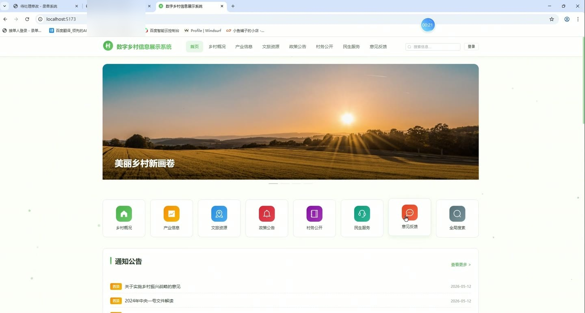
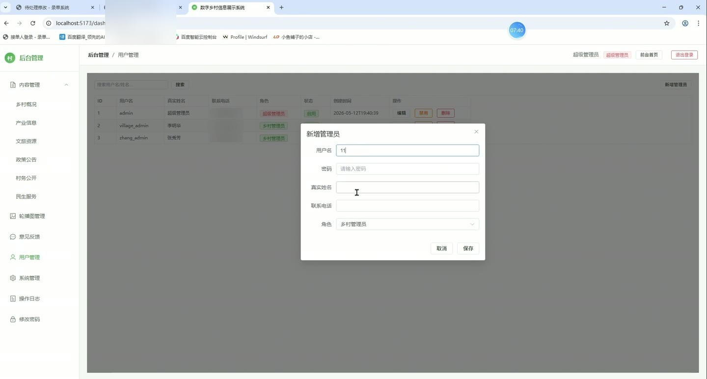
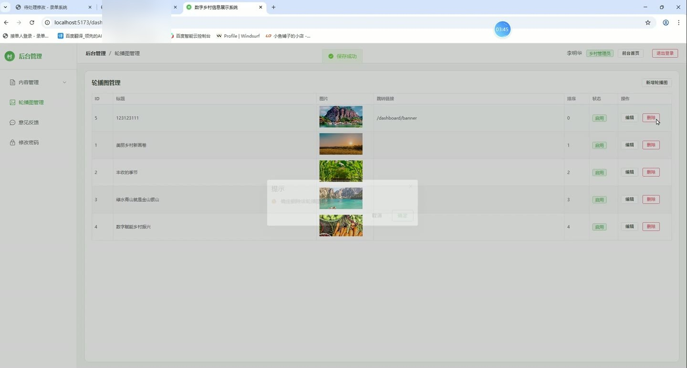
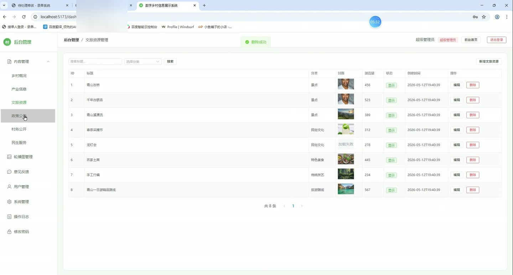

# (附文档)Springboot3+Vue3+MySQL 数字乡村信息展示系统

**技术栈**：Springboot3、Vue3、MySQL

### 系统简介

本系统是一套基于 SpringBoot3 + Vue3 + MySQL 构建的数字乡村信息展示平台，采用前后端分离架构。系统面向普通浏览用户与后台管理员两大角色，提供乡村概况、产业信息、文旅资源、政策公告、村务公开、民生服务等核心板块的信息展示与管理功能，同时集成基于物品协同过滤算法的个性化内容推荐引擎，实现乡村信息的数字化展示与运营管理。
 
### 核心功能
 
### 普通用户端

- 浏览首页聚合数据，包括轮播图、最新公告、乡村概况摘要、热门文旅、热门产业及最新村务

- 按分类与关键词筛选乡村概况列表，查看详情并自动累计浏览量

- 按分类与关键词筛选产业信息列表，查看详情并自动累计浏览量

- 按分类与关键词筛选文旅资源列表，查看详情并自动累计浏览量

- 按分类与关键词分页查看政策公告列表（置顶优先），查看详情并自动累计浏览量

- 按分类与关键词分页查看村务公开列表，查看详情并自动累计浏览量

- 按分类与关键词筛选民生服务列表，查看详情并自动累计浏览量

- 提交意见反馈，填写联系人姓名、联系电话与反馈内容

- 全局搜索功能，跨乡村概况、产业信息、文旅资源、政策公告、村务公开、民生服务六大板块检索标题与内容

- 浏览时自动记录浏览记录（基于 sessionId），触发基于物品协同过滤的个性化推荐，推荐相似内容
 
### 管理员端

- 管理员登录认证，支持 Bearer Token 鉴权，记录登录操作日志（含 IP 地址）

- 查看后台仪表盘统计概览，展示乡村概况、产业信息、文旅资源、政策公告、村务公开、民生服务、意见反馈、轮播图、管理员用户等各模块数据总量

- 轮播图管理：新增、编辑、删除轮播图，支持设置标题、图片链接、跳转链接、排序号及启用状态

- 乡村概况管理：按标题关键词与分类筛选列表，新增、编辑、删除乡村概况条目，支持富文本内容与封面图

- 产业信息管理：按标题关键词与分类筛选列表，新增、编辑、删除产业信息条目，支持富文本内容与封面图

- 文旅资源管理：按标题关键词与分类筛选列表，新增、编辑、删除文旅资源条目，支持富文本内容、封面图、地址与联系方式

- 政策公告管理：按标题关键词与分类筛选列表，新增、编辑、删除政策公告，支持置顶开关、来源标注与富文本内容

- 村务公开管理：按标题关键词与分类筛选列表，新增、编辑、删除村务公开条目，支持附件上传与富文本内容

- 民生服务管理：按标题关键词与分类筛选列表，新增、编辑、删除民生服务条目，支持富文本内容与封面图

- 意见反馈管理：按状态筛选反馈列表，查看反馈详情，回复反馈内容（自动记录回复时间并更新状态），关闭反馈，删除反馈

- 管理员用户管理（仅超级管理员）：按用户名/姓名关键词筛选用户列表，新增用户（MD5 加密密码）、编辑用户信息、删除用户、启用/禁用用户账号

- 操作日志查看（仅超级管理员）：按操作描述或用户名关键词筛选，查看所有管理员的操作记录

- 系统配置管理（仅超级管理员）：查看与修改系统名称、版本号、JWT 过期时间、上传限制、维护模式等配置项，配置持久化至文件

- 数据库备份管理（仅超级管理员）：查看备份信息（上次备份时间、数据库大小、备份数量），创建数据库备份（支持 mysqldump 自动导出或逐表 SQL 导出），下载最新备份文件，清理超出 5 个的旧备份

- 系统监控（仅超级管理员）：实时查看 JVM 运行时长、内存使用率、磁盘使用率、数据库当前连接数

- 文件上传：支持任意格式文件上传，按日期自动分目录存储，返回可访问的 URL

- 修改当前登录管理员密码，需验证原密码
 
### 技术栈

后端框架Spring Boot 3.x
ORMMyBatis-Plus（代码生成器、LambdaQueryWrapper、分页插件）
权限认证JWT（Bearer Token 鉴权）
前端框架Vue 3.x
状态管理Vue Router（前端路由）
构建工具Vite
数据库MySQL（支持 InnoDB 引擎）
工具库Hutool（MD5 加密）、Lombok（实体简化）
 
### 交付内容

- 后端完整源码

- 前端完整源码

- 数据库初始化脚本

- 万字文档

## 界面展示

---

## 获取完整源码 + 万字文档

本仓库为项目介绍页。**完整前后端源码、数据库初始化脚本、万字项目文档**，请加微信 `kangkangcode`，或访问 [codekk.top](http://codekk.top) 获取。

可作课程设计 / 毕业设计参考，支持远程部署调试。